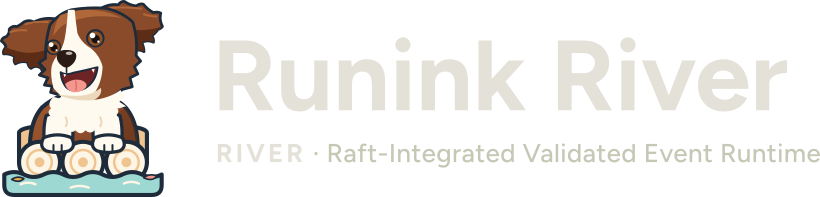

<p align="center">
  
</p>

# Runink River: an optimized developer workstation on s6

<!-- Badges: build, security, compliance, community, distribution. Each one is explained,
with its source and what unlocks the pending ones, in docs/governance/BADGES.md. The
repository slug org-runink/river appears in every URL; BADGES.md has the one-line command
that repoints them if the project moves. -->
[](https://github.com/org-runink/river/actions/workflows/ci.yml?query=branch%3Amain)
[](https://scorecard.dev/viewer/?uri=github.com/org-runink/river)
[](https://github.com/org-runink/river/actions/workflows/reuse.yml?query=branch%3Amain)
[](docs/LICENSING.md)
[](CONTRIBUTING.md#developer-certificate-of-origin-dco)
[](https://github.com/org-runink/river/stargazers)

<!-- badge:pending openssf-best-practices
  Unlock: owner registers the public repository at https://www.bestpractices.dev/ and the
  project reaches "passing"; replace PROJECT_ID with its number. The same image shows
  "silver" and "gold" when those levels are awarded (no second badge). Place after Scorecard.
[](https://www.bestpractices.dev/projects/PROJECT_ID)
-->
<!-- badge:pending reuse-api
  Unlock: owner registers the public repository at https://api.reuse.software/register
  (confirmation mail to a maintainer). Replaces the REUSE workflow badge above.
[](https://api.reuse.software/info/github.com/org-runink/river)
-->
<!-- badge:pending lfaidata-sandbox
  Unlock: the LF AI & Data TAC votes to accept the project as Sandbox. Place first in the
  row. At Incubation or Graduation change the message to that stage.
[](https://lfaidata.foundation/projects/)
-->
<!-- badge:pending aur-linux-runink
  Unlock: a maintainer publishes packaging/aur/linux-runink to the AUR
  (packaging/aur/PUBLISHING.md). Place after stars.
[](https://aur.archlinux.org/packages/linux-runink)
-->
<!-- badge:pending release
  Unlock: the first signed release (runink-os-YYYY.MM tag, SHA256SUMS.asc made with the
  release-engineering key whose fingerprint is in KEYS). Place last.
[](https://github.com/org-runink/river/releases/latest)
-->
<!-- badge:pending slsa
  Unlock: release-attest.yml has attested a published release (Build L1, signed
  provenance). Level 3 needs the ISO built on an isolated ephemeral builder that emits
  its own provenance (ROADMAP milestone 12); change the image to level3 only then.
[](https://slsa.dev/spec/v1.0/levels#build-l1)
-->

**Runink River** is a small, auditable Linux distribution for developers who work with
data, analytics and AI on hardware they own. It installs KDE Plasma (Wayland) on **s6**,
never systemd, with one pinned throughput-tuned kernel, an **encrypted ZFS root** with boot
environments, a **default-deny firewall** and a **sandbox** for code you do not trust. There
is no app store and no telemetry, and nothing in the image calls a hosted AI service.

## At a glance

| | |
|---|---|
| **What it is** | A developer workstation operating system: KDE Plasma on s6, one pinned kernel (`linux-runink`), an encrypted ZFS root with boot environments, a default-deny firewall, `river-sandbox` for untrusted code, and a graphical installer that sizes the machine before it touches a disk. |
| **Who it is for** | Developers and teams who build data, analytics and AI software on their own machines and need to know exactly what runs there; and distributions that want a small, auditable base to build on. |
| **Why it matters** | You can check what runs on your machine. Every upstream is pinned by version and checksum, the rules every change must keep are written down as [invariants](AGENTS.md) and checked in CI, releases are signed offline, and the whole image can be rebuilt from this repository. |
| **Status** | Pre-release. **No signed release has been published yet.** The first release ships only after it installs, reboots, unlocks its disk and reaches a working desktop on real hardware; that gate is still open. The image is assembled with transitional Artix Linux ISO tooling while the project moves to its own from-source base ([docs/OWN-BASE.md](docs/OWN-BASE.md)). |
| **Licence** | **MIT** by default ([LICENSE](LICENSE)); the kernel packaging tree is GPL-2.0-only and the OpenZFS packaging tree CDDL-1.0, shipped as a separate module package. Every file is mapped in [REUSE.toml](REUSE.toml), and CI checks REUSE 3.3 compliance ([docs/LICENSING.md](docs/LICENSING.md)). |
| **Governance** | Open and written down: [GOVERNANCE.md](GOVERNANCE.md) (lazy consensus, with a public TSC vote as the fallback), [MAINTAINERS.md](MAINTAINERS.md), a draft foundation [CHARTER.md](CHARTER.md). Today Runink River is a single-vendor project with one maintainer. Incubation at a vendor-neutral foundation is planned; **nothing has been submitted**. |
| **Contribute** | [CONTRIBUTING.md](CONTRIBUTING.md): sign off every commit under the [DCO](CONTRIBUTING.md#developer-certificate-of-origin-dco) (`git commit -s`); there is no CLA. Ask in [Discussions](https://github.com/org-runink/river/discussions), report bugs in [Issues](https://github.com/org-runink/river/issues). |
| **Security** | Report privately through GitHub's [private vulnerability reporting](https://github.com/org-runink/river/security/advisories/new) or to `security@runink.org` (OpenPGP). Receipt is acknowledged within 3 working days ([SECURITY.md](SECURITY.md)). |

Runink River is the open-source upstream: vendors build their own distributions on it with
out-of-tree profiles and payloads, and none of them is part of this repository.

The project is always named in full, "Runink River": a bare "River" is the name of an
unrelated Wayland compositor. The identifiers (`runink-*` packages, `river-*` tools,
`/etc/runink`) stay as they are.

Releases are dated image sets (`runink-os-YYYY.MM`). Every release ISO, its `SHA256SUMS`
and the packages are signed offline with the Runink River release-signing OpenPGP key
([KEYS](KEYS): `95C0A7B97D547413E42660DDB06FE75626F15BF3`), with SBOMs (SPDX, CycloneDX) and
build provenance ([RELEASE.md](RELEASE.md)). Until the first release is published,
`install.sh` stops before downloading any image, because there is nothing it could verify.

* Documentation: <https://docs.runink.org/river/> (built from [`website/`](website/))
* Continuous integration: [Tier 1 on every pull request](docs/governance/CI.md) (lint,
  REUSE, Go tests, gosec and govulncheck, installer checks in an ephemeral rootless container)
* Downloads: GitHub Releases, from the first signed release (see [Get Runink River](#get-runink-river))

## Overview and scope

* **s6 supervision, never systemd.** s6 / s6-rc / s6-linux-init + elogind as PID 1 and
  service manager; SDDM, Bluetooth and printing run as s6 services, each with its own
  reliable logger.
* **A Plasma developer desktop.** KDE Plasma 6 on Wayland from an explicit package list (no
  plasma-meta, no app store, no Flatpak), PipeWire, Firefox with telemetry off, and
  developer tools: `git`, `curl`, `base-devel`, `go`, Konsole, Kate.
* **One kernel.** `linux-runink`, a pinned fork of the zen kernel 7.2.x stable series,
  sha256-pinned and signature-verified, with an enforced configuration floor (cgroup v2,
  eBPF with BTF and BPF LSM, `sched_ext`, hardening) and an analytics profile; full
  preemption is selected at boot for a responsive desktop ([docs/KERNEL.md](docs/KERNEL.md)).
* **Encrypted ZFS root.** Every dataset under an aes-256-gcm encryption root, `/home` its
  own dataset, boot environments under `<pool>/ROOT/*`, a one-time recovery key, zram swap;
  OpenZFS ships as a separate module package ([docs/ENCRYPTION.md](docs/ENCRYPTION.md)).
* **A graphical, zero-knowledge installer.** Click Next: network first, a hardware probe
  (`river-hwprobe`) and an install plan (`river-plan`: RAM budget, ZFS layout), a refusal
  below the documented minimums, and a disk erased only after you confirm it
  ([docs/INSTALL.md](docs/INSTALL.md), [docs/INSTALLER-HARDWARE.md](docs/INSTALLER-HARDWARE.md)).
* **A default-deny firewall** for IPv4 and IPv6 from first boot: replies, DHCP, ICMP and
  mDNS in, everything out, no routing unless you list an interface; SSH is closed until you
  open it (`/etc/runink/fw-open`).
* **Confinement.** `river-sandbox` (bubblewrap) runs untrusted code with every namespace
  unshared, no capabilities, no network unless asked, and a deny-list of secret paths.
* **Least exposure.** Shadow-grade file modes re-asserted on every boot (`river-perms`), no
  secrets in the image, every upstream pinned by version and checksum.
* **Downstream support.** The kernel, OpenZFS, the installer, the payload and first-boot
  contract ([docs/PAYLOADS.md](docs/PAYLOADS.md)) and external profiles
  ([docs/BUILD.md](docs/BUILD.md), "Downstream distributions") let a vendor build its own
  image, for example a server with a cluster, from this repository.

### Why s6 in regulated environments

Operators in finance, health, critical infrastructure and the public sector have to show
that every part of their stack is minimal, auditable and predictable, and PID 1 is the part
every other part depends on. s6 is small enough to review, restarts services
deterministically, supports readiness notification, and gives each service its own
reliable logger, so no log line is lost. Those properties map onto least-functionality,
audit-logging and system-integrity controls such as NIST SP 800-53 and the CIS benchmarks.
Runink River makes s6 a project invariant and builds the rest of the image to the same
standard. It is built to help operators meet those obligations; it is **not** certified
against any framework.

## Get Runink River

### One command

On any Linux x86_64 host with `curl`, `gpg` and `sha256sum`:

```bash
curl -fsSL https://raw.githubusercontent.com/org-runink/river/main/install.sh | sh
```

[`install.sh`](install.sh) fetches the latest release's `SHA256SUMS` and its detached
signature `SHA256SUMS.asc`, imports the release key from
`https://runink.org/.well-known/gpg-key.txt` and refuses it unless its fingerprint is the one
pinned in the script (the same as [KEYS](KEYS)). It then checks that signature, downloads the
ISO (`runink-river-<date>-x86_64.iso`) into the current directory and checks it against the
signed sum. Any failure stops it, and a bad download is deleted. It never runs `sudo` itself,
and it sends nothing anywhere but those requests. Options go after `sh -s --`:

* `--dry-run` verifies the release metadata and prints what it would download and write,
  changing nothing:

  ```bash
  curl -fsSL https://raw.githubusercontent.com/org-runink/river/main/install.sh | sh -s -- --dry-run
  ```

* `--write /dev/sdX` also writes the verified ISO to a USB stick, which **erases it**. It
  accepts only a whole USB or removable disk that is not mounted and reports a serial number,
  and asks you to type that serial to confirm (`--yes-i-have-checked-serial=SERIAL` confirms
  without a terminal). Run as a normal user, it stops and prints the exact
  `sudo dd ...` command to run instead:

  ```bash
  curl -fsSL https://raw.githubusercontent.com/org-runink/river/main/install.sh | sh -s -- --write /dev/sdX
  ```

* `--out DIR` puts the ISO in `DIR` instead of the current directory.

### Download and verify by hand

From the release page, download the ISO (or its numbered `.part-NN` files, when the ISO is
larger than GitHub's 2 GiB asset limit), `SHA256SUMS` and `SHA256SUMS.asc`, then:

```bash
curl -fsSLO https://runink.org/.well-known/gpg-key.txt
gpg --import gpg-key.txt
gpg --fingerprint 95C0A7B97D547413E42660DDB06FE75626F15BF3   # must be exactly this fingerprint
gpg --verify SHA256SUMS.asc SHA256SUMS                      # "Good signature", same primary key
cat runink-river-<date>-x86_64.iso.part-* > runink-river-<date>-x86_64.iso   # only for a split ISO
sha256sum -c --ignore-missing SHA256SUMS                    # the ISO must say OK
sudo dd if=runink-river-<date>-x86_64.iso of=/dev/sdX bs=4M conv=fsync oflag=direct status=progress
```

[docs/VERIFY.md](docs/VERIFY.md) and [docs/RELEASE-SIGNING.md](docs/RELEASE-SIGNING.md) have
the details, including SBOMs and build provenance.

### Hardware

The installer's planner (`river-plan --profile workstation`) refuses a machine below these
minimums ([docs/INSTALLER-HARDWARE.md](docs/INSTALLER-HARDWARE.md), "Profiles"):

| What | Minimum |
|---|---|
| Firmware | UEFI (no legacy BIOS boot) |
| CPU | x86-64-v3 (AVX2, FMA, F16C, BMI1/2, MOVBE) |
| Physical cores | 2 |
| RAM | 8 GB installed (7168 MiB MemTotal) |
| Target disk | one internal disk of 64 GiB or more that is not the boot medium, not USB and not removable; the installer erases it after you confirm its serial |

You also need a USB stick at least as large as the ISO.

### Install

Boot the stick (UEFI): the live Plasma session opens the graphical installer, which ends with
a one-time recovery key and a machine that boots to the login screen. (`sudo runink-install`
is the same installer in text mode.) See [docs/INSTALL.md](docs/INSTALL.md).

## Runink River kernel for Arch Linux (AUR)

`linux-runink` is also packaged for Arch Linux as a community package in the AUR, with
`zfs-linux-runink` for OpenZFS: the zen kernel 7.2.x stable series with an analytics and
data-pipeline configuration (250 Hz tick, lazy preemption, transparent huge pages on
`madvise`, BBR with `fq`, zen's desktop interactivity bundle off); CPU vulnerability
mitigations and hardening stay on. It is not an official Arch Linux package and is not
endorsed by Arch Linux.

```bash
git clone https://aur.archlinux.org/linux-runink.git && cd linux-runink
gpg --import keys/pgp/*.asc && makepkg -si
```

No benchmark comparison with linux-zen or linux-lts has been published yet;
`bench/analytics/` is the harness ([docs/KERNEL.md](docs/KERNEL.md),
[packaging/aur/PUBLISHING.md](packaging/aur/PUBLISHING.md)).

## Roadmap

The **[roadmap](ROADMAP.md)** lists outcomes in dependency order: the first signed release,
CI that installs the image in a VM on every change, the own from-source base, reproducible
ISOs, Secure Boot, published kernel benchmarks, the RIVER pipeline runtime (`riverd`,
*Raft-Integrated Validated Event Runtime*: typed data contracts, golden tests and per-step
lineage) and vendor-neutral governance. Incubation at a Linux Foundation umbrella
(LF AI & Data) is planned; the [application](docs/governance/lfaidata-proposal.md) is a
draft and **has not been submitted**. Where the project stands against the foundation and
OpenSSF criteria is in [docs/governance/FOUNDATION-READINESS.md](docs/governance/FOUNDATION-READINESS.md).

## Project status

* **Release:** no signed release yet (see [At a glance](#at-a-glance)).
* **Maintainers:** one, from one organisation ([MAINTAINERS.md](MAINTAINERS.md)). A second
  maintainer, then maintainers from other organisations, is the project's most important
  open need.
* **OpenSSF Best Practices:** not yet registered. The criterion-by-criterion
  self-assessment is [docs/governance/OPENSSF-BEST-PRACTICES.md](docs/governance/OPENSSF-BEST-PRACTICES.md);
  the badge will be shown above once it is awarded, and not before.
* **OpenSSF Scorecard:** runs on every push to `main` (`.github/workflows/scorecard.yml`);
  the current score is the badge above.
* **Adopters:** none are listed yet ([ADOPTERS.md](ADOPTERS.md) says how to add yours).

## Community and communication

Runink River works in public. Decisions are made, and recorded, where everyone can read
them: on issues, pull requests and discussions in this repository. Only security reports and
Code of Conduct reports are handled privately ([GOVERNANCE.md](GOVERNANCE.md#working-in-the-open)).

| Channel | Use it for |
|---|---|
| [GitHub Discussions](https://github.com/org-runink/river/discussions) | questions (Q&A), ideas and proposals before they become issues, announcements |
| [GitHub Issues](https://github.com/org-runink/river/issues) | bugs and agreed feature work |
| [Pull requests](https://github.com/org-runink/river/pulls) | changes, reviews and every governance decision |
| GitHub private vulnerability reporting, `security@runink.org` | security problems only, never in public ([SECURITY.md](SECURITY.md)) |
| The contact in [CODE_OF_CONDUCT.md](CODE_OF_CONDUCT.md) | Code of Conduct reports, handled privately |

There is no mailing list, chat channel or community meeting yet. When one is created it
will be announced in Discussions and listed here, and decisions taken there will still be
recorded in this repository. Help with using Runink River: [SUPPORT.md](SUPPORT.md).

## Out of scope

* **Applications and platforms.** Runink River ships no application logic and no cluster;
  distributions built on it add their own as out-of-tree profiles and payloads.
* **systemd, and any second kernel.** Both are excluded by the project invariants in
  [AGENTS.md](AGENTS.md); changing an invariant needs a TSC vote.
* **Telemetry and hosted AI services.** Nothing in the image reports usage or calls one.

## Upstream projects

Runink River builds on, and pins by version and checksum:

* Kernel: [Linux](https://kernel.org) with the [zen patch set](https://github.com/zen-kernel/zen-kernel).
* Storage: [OpenZFS](https://github.com/openzfs/zfs).
* Init and supervision: [s6, s6-rc, s6-linux-init, execline and skalibs](https://skarnet.org/software/).
* Desktop: [KDE Plasma](https://kde.org/plasma-desktop/) and [PipeWire](https://pipewire.org).
* Confinement: [bubblewrap](https://github.com/containers/bubblewrap).
* Firewall: [nftables](https://netfilter.org/projects/nftables/).
* Boot: [GRUB](https://www.gnu.org/software/grub/).
* Tooling: the [Go](https://go.dev) standard library (no third-party Go modules).
* Transitional image tooling: [Artix Linux](https://artixlinux.org) artools/buildiso, on the
  build host only, until the own base replaces it.

## Information for developers

**[Documentation website](website/)**
The user documentation as a Hugo site: `make docs` builds it into
`~/.cache/river-docs-build/public`, `make docs-serve` previews it; the theme is vendored, so
neither needs a network.

**[Architecture](docs/ARCHITECTURE.md)**
How the image, the installer, the firewall and first boot fit together.

**[Building](docs/BUILD.md)**
Building the packages and the ISO (`build/local-iso.sh` does everything that needs no root
and prints the one `sudo` line; `make iso-in-builder` on any podman host), and building a
downstream distribution from an out-of-tree profile.

**[Payloads and first boot](docs/PAYLOADS.md)**
The contract a downstream product uses to add software, a setup page and encrypted data.

**[Encryption](docs/ENCRYPTION.md)**, **[Secure Boot plan](docs/SECURE-BOOT.md)**,
**[Security assurance](docs/SECURITY-ASSURANCE.md)**
How data at rest is protected and what the security design does and does not cover.

**[Release signing](docs/RELEASE-SIGNING.md)**
Verifying a download, and how releases are signed offline.

**[Package repository](docs/REPOSITORY.md)**
The signed `[runink]` pacman repository installed systems update from: its mirrors, and how
it is signed offline and published.

**[Own base](docs/OWN-BASE.md)**
The plan to replace the transitional tooling with a from-source base.

**[Invariants](AGENTS.md)**
The rules every change must keep, for humans and coding agents alike.

**[Changelog](CHANGELOG.md)**
What changed in each dated image set.

## Contributing

Contributions are welcome, and not only code: bug reports, reviews, documentation, testing
on real hardware and packaging all count toward becoming a maintainer
([GOVERNANCE.md](GOVERNANCE.md#becoming-a-maintainer)). Sign off every commit under the
[Developer Certificate of Origin](CONTRIBUTING.md#developer-certificate-of-origin-dco) with
`git commit -s`; there is no CLA. Read [CONTRIBUTING.md](CONTRIBUTING.md),
[AGENTS.md](AGENTS.md) and the [Code of Conduct](CODE_OF_CONDUCT.md) first.

## Governance

| Document | What it covers |
|---|---|
| [GOVERNANCE.md](GOVERNANCE.md) | roles, how decisions are made, how to become a maintainer, neutrality, the path to a foundation |
| [CHARTER.md](CHARTER.md) | the draft technical charter for the foundation era (not in force) |
| [MAINTAINERS.md](MAINTAINERS.md) | who the maintainers are, their affiliation and signing key |
| [CONTRIBUTING.md](CONTRIBUTING.md) | how to send a change, the DCO, the test policy |
| [CODE_OF_CONDUCT.md](CODE_OF_CONDUCT.md) | Contributor Covenant 2.1 |
| [SECURITY.md](SECURITY.md) | private reporting, response targets, the disclosure process |
| [ROADMAP.md](ROADMAP.md), [RELEASE.md](RELEASE.md) | what is next, and how a release is cut and signed |
| [TRADEMARKS.md](TRADEMARKS.md) | the project name and marks, and the project's neutrality |
| [ADOPTERS.md](ADOPTERS.md), [SUPPORT.md](SUPPORT.md) | who uses Runink River, and where to get help |
| [docs/governance/](docs/governance/) | the foundation-readiness map, the OpenSSF self-assessment, CI and licensing notes |

## License

Runink River is licensed per path, recorded in [REUSE.toml](REUSE.toml) and explained in
[docs/LICENSING.md](docs/LICENSING.md): **MIT** ([LICENSE](LICENSE)) by default;
**GPL-2.0-only** for the kernel packaging tree; **CDDL-1.0** for the OpenZFS packaging tree,
built as a separate module package and never merged into the kernel
([docs/governance/ZFS-LICENSING.md](docs/governance/ZFS-LICENSING.md)); **Apache-2.0** for
`validation/`; **CC-BY-4.0** for the artwork. Third-party files keep their upstream
licences ([LICENSES/](LICENSES/)).

The Runink name and logo are trademarks of Runink and are not licensed under any of the
above; see [TRADEMARKS.md](TRADEMARKS.md) and [NOTICE](NOTICE). Linux® is the registered trademark of Linus Torvalds in the
U.S. and other countries.
