# Installing Runink River

Runink River is a developer workstation. The installer is the same program for every
edition built from this repository; the sections marked **(server edition)** below describe
what it does for a downstream server distribution's image (first boot, enrollment, k0s), which
Runink River itself does not have.

## Requirements

- UEFI firmware (legacy BIOS boot is not supported).
- An x86-64-v3 CPU (AVX2, FMA, F16C) with at least 2 physical cores.
- At least 16 GB of RAM: the hardware plan refuses a machine below 15360 MiB (MemTotal); see [INSTALLER-HARDWARE.md](INSTALLER-HARDWARE.md).
- A whole disk of at least 64 GiB for the installation. It is repartitioned unless an
  existing pool is imported.

## Get the ISO

```sh
curl -fsSL https://raw.githubusercontent.com/org-runink/river/main/install.sh | sh
```

`install.sh` downloads the release ISO, `runink-river-<date>-x86_64.iso`, and can write it to a
USB stick (`--write /dev/sdX`, which erases the stick after you confirm its serial). To build the ISO yourself, see
[BUILD.md](BUILD.md).

The ISO contains the complete operating system, the desktop and the installer; nothing is
downloaded during the installation. (A downstream server medium may also carry encrypted
model weights next to the image, [MODEL-PAYLOAD.md](MODEL-PAYLOAD.md).)

## Installing with the graphical installer

This is the way to install for anyone, including someone who has never used Linux. Nothing
has to be typed at a command line: every screen has one obvious button, and the technical
detail is behind a **Details** link.

1. Write the ISO to a USB drive, plug it in, and start the computer from it. On most
   computers a key pressed at power-on opens the boot menu (F12, F11, F8 or Esc).
2. The installer opens by itself, full screen, when the live desktop appears. An **Install
   Runink River** icon on the desktop opens it again if you close it. (A downstream server
   medium shows it straight after start-up, on the computer's own screen.)
3. Click **Next** on each screen:

| Screen | What happens |
|---|---|
| **Welcome** | Choose the language (English, Español, Français, Português) and the keyboard layout. A test field shows what the keys type. |
| **What to install** | The image this USB drive started is selected. If the drive also carries the other image, choosing it tells you to restart and pick it in the start-up menu (**Restart now**). An edition that installs different kinds of node lists them here. |
| **Network** | The network is set up automatically: *Connected: wired, IPv4 + IPv6*. Without a cable, **Connect to Wi-Fi** lists the networks and asks for the password. **Continue without internet** is always fine: the installation needs nothing from the internet. |
| **Your computer** | The processor, the memory and **the disk that will be erased** (model, size and serial number), chosen by the hardware plan ([INSTALLER-HARDWARE.md](INSTALLER-HARDWARE.md)). A computer below the minimum requirements says why, in plain words; **Details** has **Try anyway (lab)** for test machines. |
| **Erase and install** | The one safety question: a red button, then *This deletes everything on …; type ERASE to confirm*. The word is shown in the screen's language (BORRAR, EFFACER, APAGAR; ERASE always works). It confirms exactly the disks shown, by serial. |
| **Name and administrator** | The computer's name and the administrator's user name are filled in; choose a password and type it twice. **Add an SSH key** (optional) takes a pasted public key. The root account stays locked. |
| **Recovery key** | The disk is encrypted. The key is shown large, with a QR code for a phone, and **Save to "…"** writes it as a text file to a second USB drive when one is plugged in (never to the installation drive). **Start installing** unlocks only once *I have written it down or saved it* is ticked. |
| **Installing** | A progress bar, one line per step in plain words, and the time left. If a step fails: a short explanation, **Show details** (the log) and **Retry**. |
| **Finished** | *Remove the USB drive, then restart.* **Restart** restarts the computer. It starts the Plymouth splash, asks for the disk passphrase, and opens the login screen; log in with the administrator's password. |

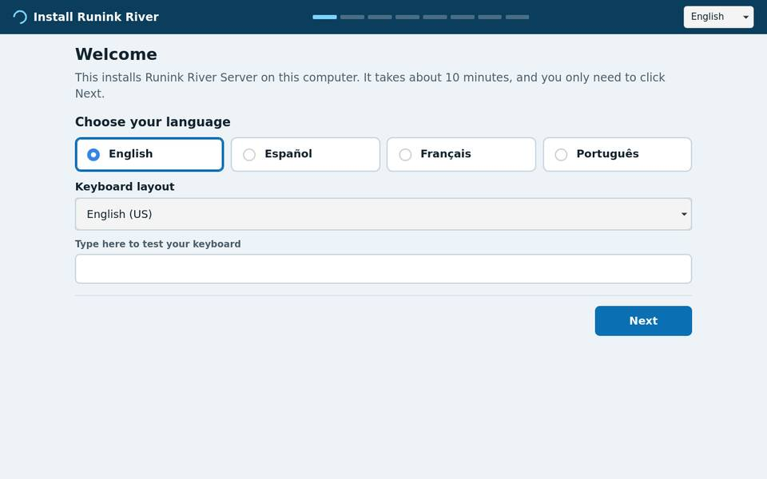
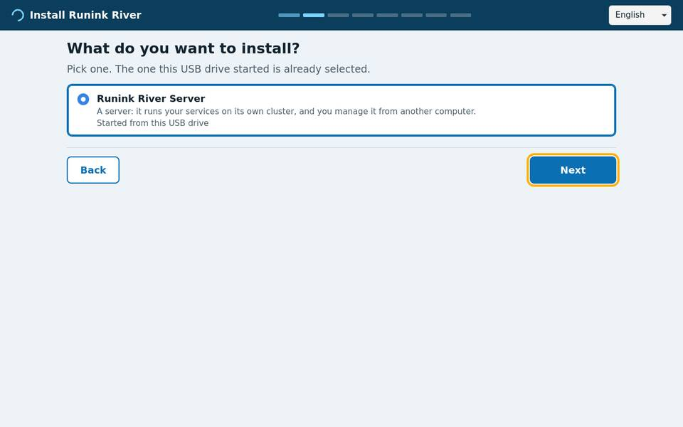
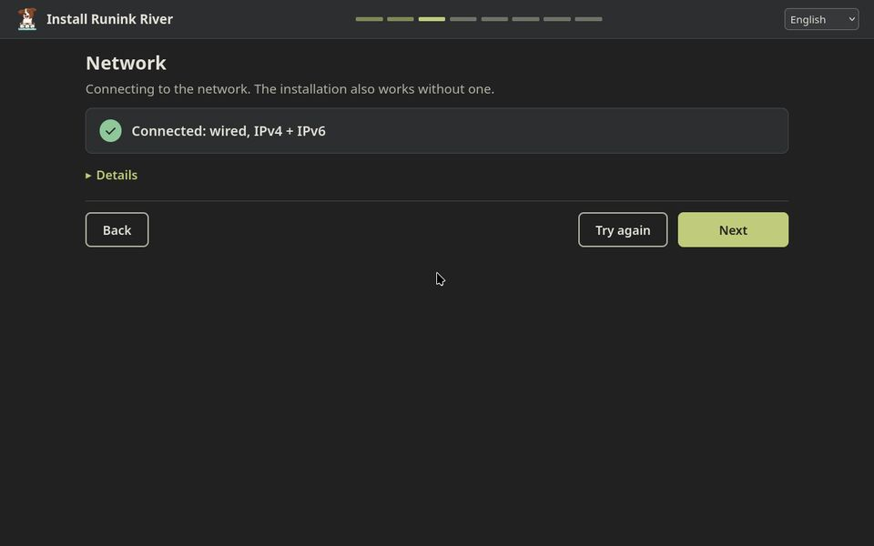
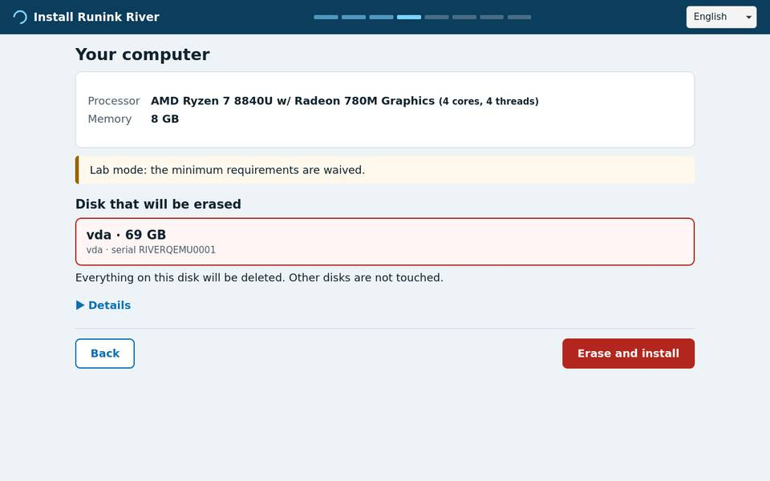
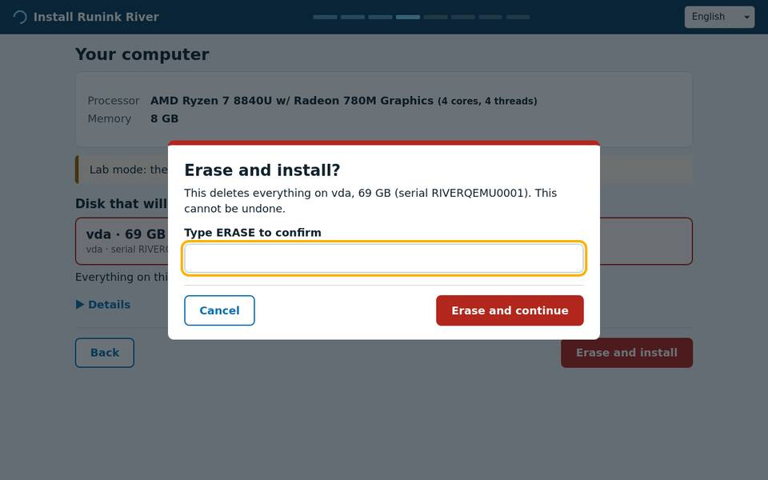
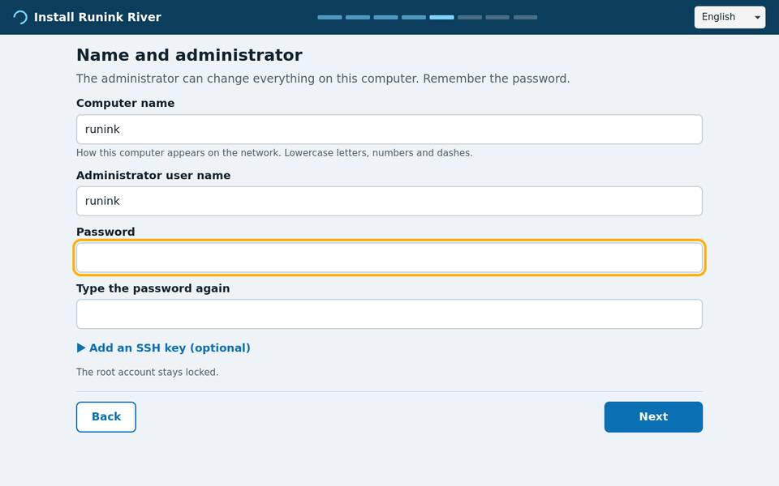
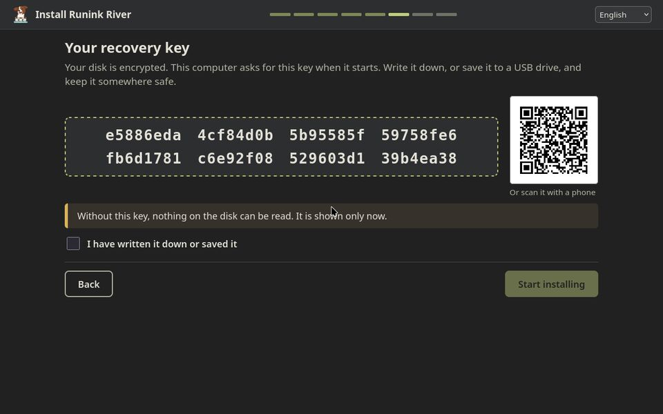
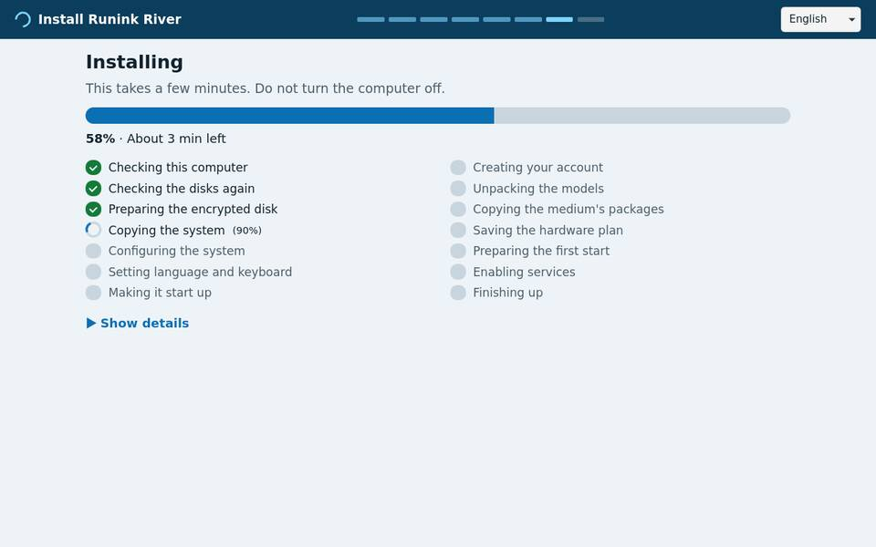
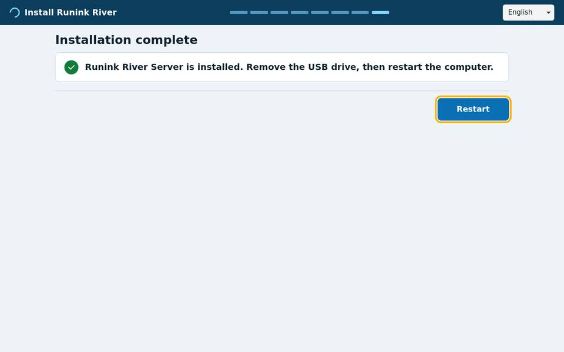

The consoles stay available for recovery: on the Runink River medium **Ctrl+Alt+F2** is a text
console, logged in automatically. (On a server medium, **Alt+F2** is that console, the
installer pauses while it is shown and **Alt+F1** brings it back, and a server distribution
may run [river-guide](INSTALL-GUIDE-AGENT.md) on **Alt+F3**.) The text installer
(`sudo runink-install`, [Install](#install)) and the unattended one
([`runink-autoinstall`](#unattended-install)) work exactly as before.

### The first start (server edition)

Runink River's first start is the login screen. What follows is a server edition's.

A **server** installed this way starts with a graphical first boot on its screen:

1. *Setting up …* checks, one by one, the **network**, the **clock** (synchronised from the
   configured time servers, `/etc/runink/ntp-servers`, or the network's gateway), the
   **firewall** (default-deny, only SSH let in) and the **cluster** (the k0s node becomes
   Ready, which takes a few minutes the first time).
2. If the medium carried a downstream platform, its own setup appears next, in the same
   window ([PAYLOADS.md](PAYLOADS.md#first-boot-setup-pages-the-graphical-hand-off)). A setup step
   that fails is shown in plain words with **Retry**.
3. *Your … is ready* shows the computer's name, its addresses, the SSH command to reach it and
   (under **Details**) the SSH host key fingerprints. **Finish** closes the screen, removes the
   kiosk from the node and leaves the normal login prompt.

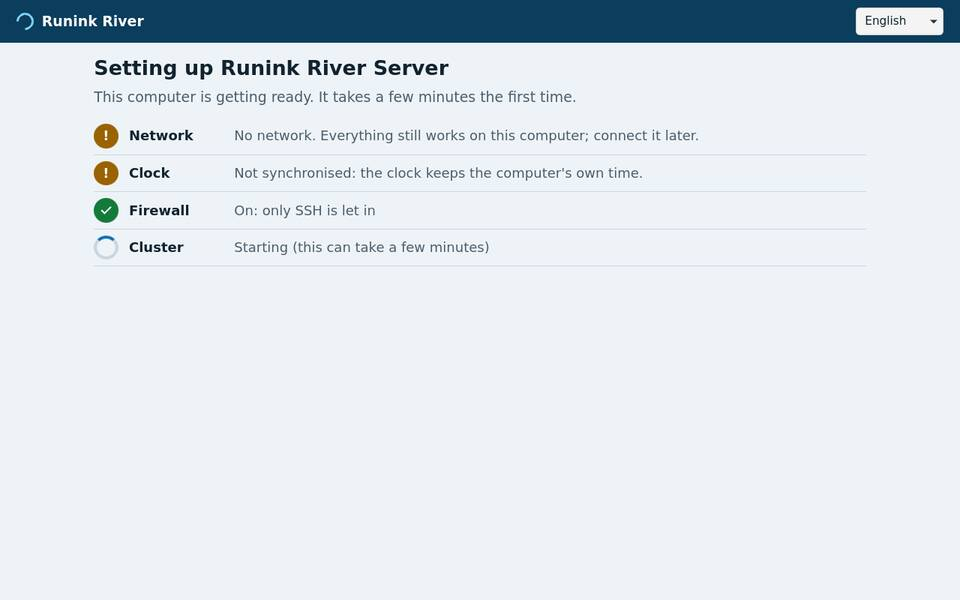
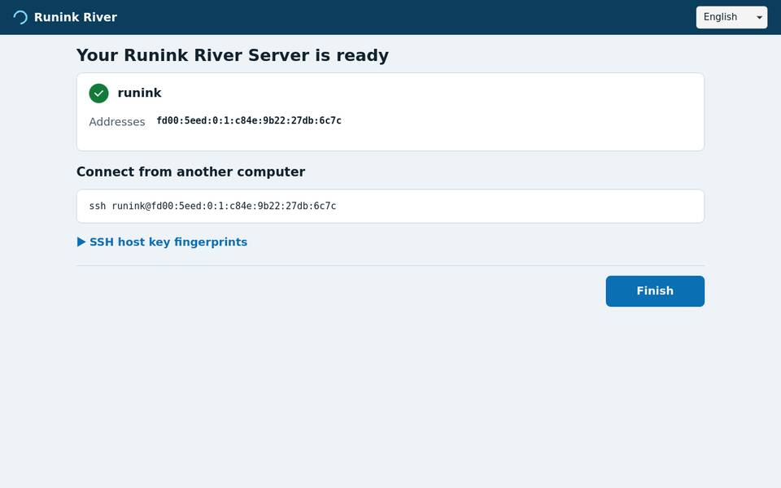

A **workstation** starts to its login screen; after the first login it is in the desktop, with
the network the installer used already set up. Nothing else is left to do.

### How it works

- **One backend, one UI.** `river-installer` (in `runink-installer`, Go standard library, MIT)
  serves a small web UI (plain HTML, CSS and JavaScript; the strings of each language in
  `i18n/<lang>.json`) and a JSON API on `http://[::1]:47660/`, and runs the existing pieces
  behind it: `river-netsetup`, `river-hwprobe` and `river-plan`, and the same
  `installer/lib` steps as `runink-autoinstall`. The UI only shows the backend's state, so
  a UI that reloads or a backend that restarts (s6 restarts it) comes back on the same screen.
- **Edition descriptors.** The installer knows no edition by name. Each image describes what
  it can install in `/usr/share/river/installer/editions/*.json` (live medium only):

  ```json
  {
    "version": 1, "id": "server", "title": "Runink River Server",
    "description": {"en": "…", "es": "…", "fr": "…", "pt": "…"},
    "medium_label": "RIVER", "plan_profile": "server", "plan_models": true,
    "steps": ["00-preflight", "05-hwplan-verify", "10-disk-zfs", "…", "90-export"],
    "roles": [{"id": "server", "title": {"en": "Server"}}], "default_role": "server",
    "firstboot_ui": true, "hostname": "runink", "admin_user": "runink",
    "icon": "/usr/share/…/mark.svg"
  }
  ```

  The running image is the descriptor whose `medium_label` is the live medium's volume label
  (`label=` on the kernel command line); another descriptor is offered when a volume with its
  label is present (a stick that carries both images). `roles` are optional; the choice reaches
  the node as `/etc/runink/role` and the first-boot hooks as `RIVER_ROLE`. `icon` (optional)
  is the edition's own mark, used as the UI's favicon and header logo. `models_required`
  (optional, default false; needs the `72-models-payload` step) makes the account screen require
  the medium passphrase and the model step fail rather than defer the models
  ([MODEL-PAYLOAD.md](MODEL-PAYLOAD.md), "Installing from it").
- **Display.** The server medium draws the UI with WPE WebKit's MiniBrowser straight through
  KMS/DRM, with no X server and no compositor (`river-kiosk`, as the unprivileged
  `river-kiosk` user, in private mode, with a content filter that allows only the loopback).
  It is live-only (`Packages-Live`: `wpewebkit`, `ttf-dejavu`); an installed server keeps it
  only until its graphical first boot finishes, and removes it then, so the node carries no
  display stack (`forbidden.closure`; `tests/assert-golden.sh` checks). That backend draws no
  mouse pointer on most displays (not on its legacy KMS path, not without a hardware cursor
  plane, not without a cursor theme), so the kiosk opens the UI with `#kiosk` and the UI draws
  the pointer itself (`kiosk-pointer.js`, which also opens drop-down lists on a click: the web
  view has no pop-up for them). Use a relative mouse: WPE ignores absolute pointers,
  such as a BMC remote console in absolute mode. The workstation uses
  the Firefox it already has, in kiosk mode.
- **Security.** The API listens on the IPv6 loopback only, answers only root, the kiosk user
  and (workstation) the live desktop user (it looks the client socket's owner up in
  `/proc/net/tcp6`), checks the Host header and requires a JSON body with an `X-River` header
  for every change. The password is hashed in the backend's memory (SHA-512 crypt) and only
  the hash reaches the installer step. The recovery key is generated in memory, shown, handed
  to `10-disk-zfs` on its standard input (`RUNINK_ZFS_KEY=stdin`), never written to a file or
  logged, and forgotten when the install ends. Serving the UI to another computer on the LAN
  is possible later over the existing pairing trust ([LAN installs](#lan-installs)); it is not
  done today.
- **Testing.** `build/qemu-gui-test.sh ISO` installs Runink River with no human: it drives the
  API with the same calls the UI makes (`river-installer drive`), photographs every screen in
  the live desktop, reboots into the installed system, unlocks it, checks that `/home` is
  mounted, the firewall loaded and the machine-id set, types the password at SDDM and waits
  for Plasma (`plasma-login`), then checks the network (`net-ready`). `--profile server`
  (with `RIVER_PROFILE_DIR`) does the same for a downstream server medium: the kiosk, a mouse
  click in it (`gui-pointer`), the
  first boot to *ready* (k0s Ready) and Finish removing the kiosk. A profile's own checks in
  `tests/installed.d/` then run on the installed machine and count in the verdict
  ([BUILD.md](BUILD.md#installed-system-checks)). `river-installer serve --demo` shows the UI on any
  machine without touching anything.

## Network first

Setting up the network is the **first action** of every Runink River live session, on both
images, before the guide, the hardware probe or any installer question. `river-netsetup`
does it (a POSIX sh wrapper over NetworkManager's `nmcli` and `nmtui`, with a small Go
helper, `river-netcheck`, for the check; both ship in the `runink-installer` package):

- **Runink River Server:** the graphical installer's network screen runs
  `river-netsetup --auto` ([Installing with the graphical installer](#installing-with-the-graphical-installer));
  tty3 runs it before `river-guide` starts (once per boot, bounded, never prompts). The guide's
  first step, `network`, shows the result (`river-netsetup --check`), and `runink-install`
  opens with it as **step 0**.
- **Runink River Workstation:** when the live Plasma session starts, the graphical installer
  opens, and its network screen comes first. The network applet in the panel (plasma-nm) is
  the other graphical way. `runink-install` opens with the same step 0.

Interactively (`sudo river-netsetup`), it offers: **automatic** wired setup
(dual-stack: IPv4 DHCP plus IPv6 SLAAC/DHCPv6, or IPv6 only for IPv6-only sites), **Wi-Fi** (scan, pick a network, type its passphrase), **static**
IPv4 and/or IPv6 addresses with gateway and DNS, **nmtui** for anything else (VLAN, bond,
802.1X), keep the current setup, or **offline** (networking off). Then an optional HTTP
proxy and the hostname (the installer offers it as the node's hostname).

It then checks and shows: every link with its addresses, the default routes, the DNS
servers, and whether the default gateway answers (a TCP connect, where a reset counts as an
answer, then the kernel's neighbour table), whether DNS resolves, and whether the internet
answers over IPv4 and over IPv6. The internet check is a plain TCP connect to port 443 of
a well-known host (`kernel.org` by default; `--host`, `river.net.check=HOST` or
`[check] host=` change it, `none` disables it). Nothing is downloaded, and no `curl`,
`wget` or `ping` is involved. Every probe has a short timeout and is skipped when it cannot
succeed, so a machine with no network gets its answer at once.

The outcome is one of:

| Outcome | Means |
|---|---|
| `online` | The check host answered on port 443 (IPv4 or IPv6), or the configured proxy answered. |
| `lan-only` | Not online, but a link has a routable address or a default gateway answered. |
| `offline` | Neither. |

**All three are valid:** the install copies the running live system and needs no network.
The outcome is recorded in `/run/river/net-state.json` (schema `river.net-state/v1`, mode
0644; a proxy's credentials are redacted) and `/run/river/net.env` (sh, `RIVER_NET_STATE`,
`RIVER_NET_METHOD`, `RIVER_NET_INTERNET4`, `RIVER_NET_INTERNET6`, `RIVER_NET_HOSTNAME`)
for the later steps; `runink-install` exports `RUNINK_NET_STATE` and
`RUNINK_NET_STATE_FILE` to its steps. A proxy is kept in `/run/river/proxy.env` (0600).
Nothing under `/run` reaches the installed node.

Run without a console (headless), the setup comes from the kernel command line (edit the
GRUB entry) or from a file:

```text
river.net=dhcp[,v6only][,iface=NAME]
river.net=static:ADDR/PREFIX[,ADDR/PREFIX...][,gw=ADDR][,dns=ADDR...][,iface=NAME]
river.net=off
river.net.check=HOST|none
```

For example `river.net=static:192.0.2.10/24,gw=192.0.2.1,dns=192.0.2.53` or
`river.net=static:2001:db8::10/64,gw=fe80::1,dns=2001:db8::53`. Wi-Fi is not accepted on
the kernel command line, because every local user can read `/proc/cmdline`; use a config
file (`sudo river-netsetup --config FILE`, or `runink-install --net-config FILE`):

```ini
# Comments are whole lines (# or ;): a value runs to the end of its line.
[network]
# dhcp | static | wifi | off
method = wifi
# optional; default: the first device of that type
interface = wlan0
# dhcp or wifi: true turns IPv4 off (IPv6-only sites); default false = dual-stack
ipv6-only = false
# static only: address= and gateway= repeat (IPv4 and IPv6; one gateway per family)
# address = 192.0.2.10/24
# gateway = 192.0.2.1
dns = 192.0.2.53
hostname = node-a

[wifi]
ssid = Example Lab
psk = correct horse battery staple

[proxy]
http = http://proxy.example.org:3128
no-proxy = localhost,.example.org

[check]
host = example.org
```

Unknown sections or keys are errors, so a typo never falls back to DHCP silently. The Wi-Fi
passphrase reaches NetworkManager through a 0600 file, never a command line. Other modes:
`river-netsetup --net SPEC` applies one `river.net` value, `--check` only checks (no root
needed; an unprivileged run records nothing), and `runink-install --skip-network` keeps the
network as it is.

## Install

The text installer, for operators who prefer a console. Boot the ISO in UEFI mode. GRUB boots the
live entry after a short timeout; tty1 shows the graphical installer. On tty3 (Alt+F3),
`river-guide` (the install guide agent, [INSTALL-GUIDE-AGENT.md](INSTALL-GUIDE-AGENT.md))
walks you through the steps below and answers questions about them; `quit` it for a login
prompt. On the second console (Alt+F2), where the live session logs in automatically, run:

```sh
sudo runink-install
```

Its step 0 is the network ([Network first](#network-first)): it shows the outcome the live
session recorded and asks whether to keep it or set the network up again. Any outcome
continues. Then, before it asks anything else, the installer probes the hardware (`river-hwprobe`) and makes an
install plan (`river-plan`): model tiers, RAM budget, threads and the ZFS layout across the
eligible disks. It shows the plan, stops on a machine below the documented minimums, and
asks you to type the serial of every disk it will erase. The disks come from the plan, and
the boot USB can never be one of them. See [INSTALLER-HARDWARE.md](INSTALLER-HARDWARE.md).

The installer then asks for:

| Prompt | Default | Notes |
|---|---|---|
| ZFS pool name | `zriver`, or the name of an importable pool if one is found | An existing pool is imported and keeps its name. |
| Hostname | `runink`, or the hostname chosen in the network step | |
| Boot-environment name | `runink-<version>` | |
| Path to `enrollment.env` | blank | Blank defers enrollment. See [Enrollment](#enrollment-server-edition). |
| ZFS encryption key | `generated` | `generated` creates a random key and shows it **once** as the recovery key; `own` prompts for a passphrase. Ignored when importing. |

Type `YES` to confirm. The installer then runs these steps in order, stopping at the first
failure:

| Step | Does |
|---|---|
| `00-preflight` | Checks UEFI, CPU features, RAM and the target disks. |
| `05-hwplan-verify` | Re-probes the machine and re-resolves the confirmed install plan by disk serial. Refuses if any target disk changed since you confirmed it. |
| `10-disk-zfs` | Partitions every data disk of the plan (EFI plus ZFS) and builds the planned layout (single, mirror, raidz1, raidz2, optionally a mirrored special vdev). Creates an **encrypted** pool (aes-256-gcm, encryption root at the pool root) or imports an existing one, mounts the ESP at `/boot`, and creates the boot environment `<pool>/ROOT/<be>` (`canmount=noauto mountpoint=/`) mounted at `/mnt`. An existing unencrypted pool is refused. |
| `20-clone-rootfs` | Copies the live rootfs to `/mnt` with `rsync` (install-from-live: no repository, no network), then resets live-only state (autologin account, machine-id, SSH host keys). |
| `30-target-config` | Per-node settings: hostname, `/etc/runink-os-version`, the ESP entry in `/etc/fstab`, and removal of the `curl`/`wget` binaries. |
| `35-pacman-keyring` | Initialises and populates the target's pacman keyring (the distribution keyrings and the Runink River release key) and fails if it is still empty; writes the `[runink]` stanza ([REPOSITORY.md](REPOSITORY.md)). |
| `40-boot-grub-zfs` | Sets `/etc/hostid` to the pool's hostid, puts the kernel and an initramfs (hostid, `zfs` hook, key providers) on the ESP, and installs GRUB. |
| `50-runink-user` | Creates the `runink` user (uid 1000), its subuid/subgid range and runtime directory. |
| `60-load-artifacts` | Reports whether baked container images are present in `/usr/local/share/runink/images/`; they are imported at first boot. |
| `70-secrets-models` | Copies `enrollment.env` (if given) to `/etc/runink/enrollment.env` with mode 0600, and wires `runink-firstboot.sh` into `/etc/s6/rc.local`. |
| `72-models-payload` | Only when the medium carries `/river-models`: asks for the payload passphrase (blank defers), creates the encrypted `<pool>/models` dataset at `/var/lib/core/models/shared`, unpacks and verifies every file against `models.lock`, and destroys the dataset on any failure ([MODEL-PAYLOAD.md](MODEL-PAYLOAD.md)). |
| `73-downstream-payloads` | Only when the medium carries downstream payloads (`/river-<kind>/<group>/`, a private medium): copies them **still encrypted** into the encrypted `<pool>/payloads` dataset at `/var/lib/runink/payloads`, verifying every part and LOCK against its MANIFEST; never opens or deploys them ([PAYLOADS.md](PAYLOADS.md)). |
| `76-setup-answers` | Only with `runink-autoinstall --setup-answers FILE`: copies the file to `/var/lib/runink/firstboot.d/setup-answers` (0600) for the downstream's first-boot hooks, which get it as `RIVER_SETUP_ANSWERS`; it is shredded once they have all succeeded. |
| `75-install-plan` | Writes the hardware install plan to `/etc/runink/install-plan.json` (mode 0600). |
| `80-enable-s6` | Compiles the s6-rc database and enables `river-perms`, dbus, elogind, NetworkManager, sshd and `rc-local`. |
| `90-export` | Unmounts everything and runs `zpool export`. This is required: a pool left imported keeps the installer's `/mnt` altroot, and the first boot then mounts the root in the wrong place and panics. |

Then reboot. With a generated key, the console asks for the passphrase at each boot until
a key provider is installed; see [ENCRYPTION.md](ENCRYPTION.md).

### Unattended install

```sh
river-hwprobe --json > probe.json
river-plan --probe probe.json --manifest /usr/local/share/runink/models.tiers --json > plan.json
river-plan --plan-file plan.json --list-disks          # the disks the plan erases
sudo runink-autoinstall [--plan-file plan.json] [--lab] [--models-passphrase-file FILE] \
     --yes-i-have-checked-serial=<serial> [--yes-i-have-checked-serial=<serial> ...] \
     [<disk>] [pool] [be] [hostname]
```

This runs the same steps without prompts (pool defaults to `zriver`, key to `generated`).
Without `--plan-file` it plans from a fresh probe. `--yes-i-have-checked-serial` is required
once for every disk the plan erases; a serial the plan does not erase, or a plan disk left
unconfirmed, aborts before anything is written. `<disk>`, if given, must equal the plan's
boot disk. `--lab` waives the documented minimums (VMs and test rigs only; recorded in the
plan). It skips `60-load-artifacts` and `70-secrets-models`. It runs `72-models-payload`
only with `--models-passphrase-file` (keep the file on tmpfs); without it the models are
deferred to enrollment, and `--skip-models` skips them even with the file. `73-downstream-payloads`
needs no passphrase; `--payloads-src DIR` takes the payloads from DIR instead of the medium and
`--skip-payloads` skips them. `--setup-answers FILE` hands a downstream's setup answers to its
first-boot hooks (0600, shredded after use; [PAYLOADS.md](PAYLOADS.md#first-boot-hand-off)).

### Air-gapped installs

Nothing in an install or a first boot needs a network: the installer copies the live rootfs
(no package repository), the k0s system images come with the image (`runink-k0s-airgap`,
imported by k0s from `/var/lib/k0s/images/` before kubelet starts, pull policy
`IfNotPresent`), and the node comes up as a single-node k0s cluster without an enrollment
file. Give the node a NIC with an address even when it has no route out: k0s needs a node
address. On a private medium the models are unpacked at install (with the medium
passphrase), the downstream payloads are copied onto the node still encrypted, and the
downstream's first-boot hook (`/usr/local/lib/runink/firstboot.d/`) takes over from there.
Details, formats and the offline test: [PAYLOADS.md](PAYLOADS.md).

### LAN installs

One machine (the **operator**) can drive the installs of other machines (**targets**) on
the same LAN segment. It works only with machines whose owner booted them from the Runink
River install medium and opted in on their own screen. Nothing on the network is scanned,
no existing credential is used, and no running operating system can be taken over: the
target side exists only on the live installer, and only while its local operator keeps it
open.

`sudo runink-install` first asks what the session is for (after the network step, when the
image has one):

| Entry | Runs | |
|---|---|---|
| Install this machine | the install above | |
| Let another machine install this one | `river-pair-announce` | the **target** |
| Install other machines on this network | `river-pair install` | the **operator** |

`runink-install --mode local|target|operator` skips the menu. An entry whose tools are not on
the image is not offered.

**On the target** (`river-pair-announce`, root, live medium only). It starts a one-shot s6
service for this session and shows:

- `river-install-<id>`, the name this session announces;
- a one-time **pairing code** (`XXXX-XXXX`: 7 random base32 characters and a check
  character), valid for **15 minutes**;
- the SHA256 fingerprint of a **fresh ephemeral SSH host key** made for this session.

It announces the name and the fingerprint on the local link only (UDP multicast to
`ff02::7269:7672` port 47653, hop limit 1, from the interface's IPv6 link-local address),
and opens a pairing endpoint on that link-local address (TCP 47654). When an operator
proves it knows the code, the target shows `Paired with SHA256:<operator key>` and asks
`Allow this operator to install this machine? [y/N]`. Only a local `y` starts the session's
restricted sshd (TCP 47655, link-local only), which accepts that one operator key and
nothing else. Ctrl-C ends the session at any time.

**On the operator** (`river-pair install`, any user; `river-pair list` only lists):

1. It listens on the link for announcements. It never sends a probe and never connects to a
   host that did not announce; it connects only to an announcement's source address.
2. You pick a target and type the code its screen shows. A mistyped code is caught by the
   check character on the operator and never reaches the target.
3. It shows the target's host key fingerprint. Compare it with the target's screen before
   you answer `y`.
4. It pairs. It shows its own ephemeral key's fingerprint; the target's screen shows the
   same one. The target's owner answers `y` there.
5. Over the restricted channel: the target probes and plans (`--lab` passes the waiver),
   the plan is shown here, and you type the serial of every disk the plan erases. Payload
   directories (`--payload DIR`, repeatable) are copied with `rsync` over the same channel
   into the target's RAM and staged there (`river-payloadpack stage --src --dest`; a medium
   without that tool receives them and says they are not staged). Then
   `runink-autoinstall` runs on the target with the models passphrase
   (`--models-passphrase-file`, or typed without echo) and the admin SSH public keys
   (`--admin-keys`) streamed over the channel. On the target they live in anonymous memory
   files (`memfd`) for the length of the install and are never written to a disk on either
   side.
6. The install output streams to the operator. The recovery key is shown once there and
   once on the target's screen. Then the operator reboots the target, which tears the
   session down first.

Several targets are installed one after another; each pairs with its own code and its own
local `y`, and each disk wipe needs its own typed serial. For datacenter batches,
`--answers FILE` lists the serials that may be erased without typing, one per line
(`serial <SERIAL> [hostname <NAME>]`, plus optional `pool`, `be`, `lab yes|no`,
`models-passphrase-file`, `admin-keys` and `payload` lines). The code and the target's `y`
are still needed for every machine.

The operator can run only this grammar on the target (the sshd's `ForceCommand`,
`river-pair-announce rpc`; no shell ever parses it): `hello`, `plan [--lab]`,
`stage-payload NAME`, `install --serial S ... [--pool P] [--be B] [--hostname H]`,
`reboot`, `finish`, and the receiving end of `rsync -rt --delete` into `payload/NAME/`
(run as the unprivileged pairing user, with `--munge-links`).

#### Threat model

| Threat | What stops it |
|---|---|
| A **rogue announcer** on the LAN (it wants the operator's secrets or to receive an install) | It cannot answer the pairing exchange without the code, which only the real target's screen shows: the operator verifies an HMAC over its request, keyed by the code, before it trusts the host key. The operator also compares the host key fingerprint with the target's own screen, and SSH is pinned to that key (`StrictHostKeyChecking=yes`, the known-hosts file holds that key only). |
| A **rogue operator** on the LAN | It needs the code (shown only on the target's screen) **and** the target owner's `y`, given after seeing the operator's key fingerprint. Five wrong codes lock the session; the code expires after 15 minutes; a code pairs once (a refusal spends it too). |
| Someone who **sniffs** a pairing exchange | The HMAC exposes the 35-bit code to an offline search, so a sniffer could try to pair first with its own key. It still needs the local `y`, and the target's screen shows its key's fingerprint, not the operator's. Compare the fingerprint on both screens before answering `y`. |
| **Nothing asked for** | Nothing listens unless the local operator chose "Let another machine install this one", and only while that console stays open. The service is linked into the s6 scan directory for the session only and is never in the boot database. The target side refuses to run off the live medium. An installed node carries no session template, no pairing user and no listener (`tests/assert-golden.sh` checks). |
| **Routed** traffic | Announcements from anything but an IPv6 link-local source on the listening interface are ignored, and every listener binds a link-local address. The live medium's default-deny firewall (`runink-fw`) accepts the three pairing ports (UDP 47653, TCP 47654, TCP 47655) from IPv6 link-local sources only (`fe80::/10`, the `pair_tcp`/`pair_udp` sets filled from the live overlay's `/usr/local/lib/river-pair/fw-pair`); an installed node never opens them. The segment is the trust boundary; the operator connects only to the source address of an announcement. |
| A **compromised channel** after pairing | The pairing user has no shell and no forwarding. The session holds the SSH key in RAM only, and the pairing user and staging dir are unprivileged. Every destructive step still needs a typed serial, which the target re-checks against a fresh probe (`runink-autoinstall`). |

What is logged, all in the target's live RAM (never copied to the installed node):
`/var/log/river-pair/<id>.log` records the session id, interface and host key fingerprint,
each pairing attempt (source address, outcome, attempts used), the local answer with the
operator's key fingerprint, every RPC verb and its arguments (serials, pool, hostname,
whether a passphrase and how many admin keys were sent), install and staging results, and
why the session ended. `/var/log/river-pair/sshd-<id>.log` is the session sshd's log
(`LogLevel VERBOSE`: each login with its key fingerprint). The code, the secrets and the
recovery key are never logged. On the operator, `river-pair` keeps nothing: its key and
known-hosts file live in a 0700 directory under `/run` that it removes on exit.

Tested by `build/qemu-lan-test.sh ISO`: two ≤3 GiB guests on a private QEMU segment; the
target opts in through `runink-install --mode target`, the operator pairs (after one typo
refused locally and one wrong code counted by the target) and installs onto the target's
scratch disk, the target reboots into the installed system, which is then checked.

### Installer environment variables

| Variable | Effect |
|---|---|
| `RUNINK_ZFS_KEY` | `generated` or `own` (see above). |
| `RUNINK_ALLOW_PLAINTEXT_POOL=1` | Allows installing into an existing unencrypted pool. ZFS cannot encrypt existing datasets in place; see [ENCRYPTION.md](ENCRYPTION.md#migrating-an-existing-pool) for the migration. |
| `RUNINK_TARGET` | Mount point of the target (default `/mnt`). |

## Enrollment (server edition)

Nothing secret or site-specific is baked into the ISO. It arrives in
`/etc/runink/enrollment.env`, a shell-syntax file supplied at install time or copied onto
the node later. On every boot `runink-firstboot.sh` checks for it. If it is absent, the
node stays un-enrolled: `k0s-keepalive.sh` still starts k0s in its default single-node
role, but without the enrollment-derived flags (such as disabling k0s's own CoreDNS); the
firewall stays in its base posture (default-deny, SSH open), and nothing is deployed. When the file is present, the script reads it, applies
it, **shreds it**, and writes the sentinel `/var/lib/runink/.enrolled`, after which it never
runs again.

Every variable is optional.

### Network and access

| Variable | Default | Effect |
|---|---|---|
| `NET_MODE` | `dual` | `dual` (default): the host is dual-stack, IPv4 DHCP plus IPv6 SLAAC/DHCPv6, and sshd listens on both families. `ipv6`: IPv4 off on managed interfaces and sshd on IPv6 only, for IPv6-only sites. The k0s cluster network is IPv6-only either way. Applied first, before anything that needs the network. |
| `RUNINK_SSH_AUTHORIZED_KEYS` | unset | One or more public keys (newline-separated) for `runink`'s `authorized_keys`. Without it the node is reachable only from the console. |
| `RUNINK_FW_WHITELIST` | unset | Comma- or space-separated IPs/CIDRs. When set, the `runink_fw` firewall switches from its base posture (default-deny, SSH open to all) to the private one: only these sources get in, on any port, SSH included. The firewall is on either way, from first boot. |
| `RUNINK_FW_OPEN` | unset | Ports the node serves to everyone, e.g. `tcp:80 tcp:443 udp:51820` (a public node's hostNetwork ingress). Written to `/etc/runink/fw-open`. A workload that manages its own nftables table still needs its ports here: a drop in `runink_fw` is final. |
| `RUNINK_APP_HOSTS` | unset | Space-separated public service names this node serves. Written to `/etc/runink/app-hosts`; `lan-hosts.sh` maps them to the node's own on-link address in `/etc/hosts` at boot, and `smoke-k0s.sh` probes them. |
| `RUNINK_DNS_UPSTREAMS` | derived | Space-separated resolver addresses for the cluster CoreDNS. When unset, derived from `/etc/resolv.conf`: IPv6 resolvers as-is, IPv4 resolvers through the NAT64 prefix (`192.0.2.53` becomes `64:ff9b::192.0.2.53`), loopback resolvers skipped. |

### Hurricane Electric 6in4 tunnel

For uplinks without native IPv6. The first four variables are all required to enable
the tunnel; they are written to `/etc/runink/he-tunnel.env`, which
`he-tunnel-keepalive.sh` reads. Without them the node has no global IPv6 unless the LAN
provides it.

| Variable | Example | Meaning |
|---|---|---|
| `RUNINK_HE_SERVER4` | `203.0.113.1` | HE tunnel server IPv4. |
| `RUNINK_HE_CLIENT6` | `2001:db8:1::2/64` | Client end of the point-to-point link, with prefix length. |
| `RUNINK_HE_GW6` | `2001:db8:1::1` | HE end of the link (the IPv6 default gateway). |
| `RUNINK_HE_SERVE6` | `2001:db8:2::1/64` | Address from the routed prefix, assigned to `lo`; the address public AAAA records point at. |
| `RUNINK_HE_UPLINK` | `wlan0` (default) | The interface whose public IPv4 HE has on file. |
| `RUNINK_HE_ADMIN_ROUTES` | `2001:db8:2::2/128` | Optional /128s from the routed prefix for management hosts on the uplink's LAN. |

The optional endpoint auto-update settings (`HE_UPDATE_*`) are not part of enrollment. Add
them to `/etc/runink/he-tunnel.env` by hand; `he-tunnel.env.example` documents them.

### Kubernetes (k0s)

| Variable | Default | Effect |
|---|---|---|
| `K0S_ROLE` | `single` | `single` (controller and worker on one node), `controller`, or `worker`. Written to `/etc/runink/k0s.env` for `k0s-keepalive.sh`. |
| `K0S_ENABLE_WORKER` | `1` | For `controller`: also run a worker on this node. |
| `K0S_JOIN_TOKEN` | unset | Join token for a worker, or for a controller joining an existing cluster. Stored in `/etc/k0s/join-token` (0600). A worker without a token waits. |
| `RUNINK_K0S_API_SANS` | unset | Space-separated extra names or addresses for the API server certificate, appended to `spec.api.sans` in `/etc/k0s/k0s.yaml`. |
| `K0S_KUBELET_EXTRA_ARGS` | derived | Extra kubelet flags. Whenever the host has IPv4 (the default), `--node-ip=<the host's IPv6 address>` is derived (`runink-node-ip6`, also on every `k0s-keepalive` start) and `api.address` is pinned to it, because k0s would otherwise pick the IPv4 address and the API server refuses to start against the IPv6-only service CIDR. An explicit `--node-ip` here wins. `--cluster-dns` is always appended unless set here. |
| `RUNINK_CLUSTER_DNS` | `fd00:10:96::a` | The `--cluster-dns` value; must match the clusterIP in the shipped CoreDNS manifest. |
| `K0S_EXTRA_ARGS` | `--disable-components=coredns` | Extra `k0s` flags. If you override it, keep `--disable-components=coredns`: k0s's own CoreDNS cannot deploy on an IPv6-only cluster. |

### Models and CI runner

| Variable | Effect |
|---|---|
| `MODEL_STORE_URL` | An rsync endpoint (`rsync://host.example.org/models` or `host:path` over SSH) holding the model set pinned in `models.lock`. Synced into `/var/lib/core/models/shared` and verified against `/usr/local/share/runink/models.manifest`, which is generated from `models.lock` at build time; a checksum mismatch stops enrollment. HTTPS is not supported (the node has no HTTP client). |
| `RUNNER_URL`, `RUNNER_TOKEN` | Register a GitHub Actions runner as `runink`, if the runner is unpacked at `/home/runink/actions-runner`. `runner-keepalive.sh` supervises it afterwards. |
| `RUNNER_LABELS` | Comma-separated runner labels. Default `self-hosted,river`. |

### Payload variables

A downstream payload reads its own secrets from the same file through its
`enroll.d/*.sh` hooks, which are sourced after the network, SSH and model steps and before
the file is shredded. Those variables are defined by the payload. See
[BUILD.md, "Downstream payloads"](BUILD.md#downstream-payloads).

### Example

```sh
# /etc/runink/enrollment.env
NET_MODE=ipv6
RUNINK_SSH_AUTHORIZED_KEYS='ssh-ed25519 AAAA... operator@example.org'
RUNINK_FW_WHITELIST='2001:db8:100::/56 192.0.2.0/24'
RUNINK_APP_HOSTS='app.example.org api.example.org'
RUNINK_K0S_API_SANS='node1.example.org'
MODEL_STORE_URL='rsync://models.example.org/gguf'
K0S_ROLE=single
```

### What happens after enrollment

On a controller or single node, enrollment waits up to five minutes for the k0s API, imports
any `*.tar` images from `/usr/local/share/runink/images/` into k0s's containerd, and then:

- on a **base image** (`PAYLOAD-NONE` marker), logs that nothing is deployed, by design;
- with a **payload**, runs `/usr/local/share/runink/core/deploy`;
- if the payload package is missing its `deploy` entrypoint, logs an error and writes
  `/var/lib/runink/DEPLOY-INCOMPLETE`.

Workers stop after writing their role; deployment is driven from a controller.

Verify the node with:

```sh
sh tests/assert-golden.sh
sh tests/smoke-k0s.sh
```

### Other node configuration

These files are not written by enrollment. Create them on the node when needed:

| File | Purpose |
|---|---|
| `/etc/runink/backup.env` | `runink-backup.sh`: snapshot interval, retention, and `BACKUP_TARGET` for raw, still-encrypted `zfs send` to a remote SSH host. See `backup.env.example`. |
| `/etc/runink/net.env` | `EDGE_ALIAS`: a secondary LAN address the node claims when a router port-forwards to a fixed address. |

## The ESP and `/etc/fstab`

The ESP is mounted at `/boot`. The pool is encrypted and GRUB cannot read an encrypted pool,
so the kernel, the initramfs and `grub.cfg` all live on the FAT ESP. See
[ENCRYPTION.md](ENCRYPTION.md) for why this layout was chosen over a separate unencrypted
boot pool.

ZFS datasets mount themselves from pool properties; the ESP does not, so `30-target-config`
writes its fstab entry from the partition actually mounted at the target's `/boot`:

```
UUID=<esp-uuid>	/boot	vfat	rw,noatime,fmask=0077,dmask=0077,nofail	0 0
```

This entry matters for updates. Firmware and GRUB find the ESP without it, but a kernel
upgrade on a node where the ESP is not mounted writes the new kernel and initramfs into the
`/boot` directory on the encrypted boot environment. GRUB cannot see them there, so the node
keeps booting the old kernel.

- `nofail` and fsck pass `0` are deliberate: a replaced disk or wiped ESP must degrade to
  "not mounted", never to a headless node stuck at boot.
- `fmask/dmask=0077` makes the mount root-only.
- The entry is rewritten idempotently, and a legacy `/boot/efi` line is dropped. s6 mounts
  it through the `mount-filesystems` oneshot (`mount -a`).

`tests/assert-golden.sh` checks the live mount, the fstab entry, the 0077 masks and the
presence of a kernel on the ESP. A legacy `/boot/efi` ESP is accepted with a warning.

### Nodes installed before encryption

Nodes installed before pool encryption was introduced have the ESP at `/boot/efi` and their
kernels in `/boot` on an unencrypted ZFS root, and may have no fstab entry for the ESP:

```sh
findmnt /boot/efi                        # empty output = ESP not mounted
grep -c '/boot/efi' /etc/fstab           # 0 = no entry
lsblk -o NAME,PARTTYPE,FSTYPE,MOUNTPOINT # find the ESP (PARTTYPE c12a7328-...)
```

`installer/remediation/esp-fstab-repair.sh` repairs them. It is report-only by default;
`--apply` writes the entry and mounts the ESP. It is deliberately not wired into anything:
the installer runs a hard-coded step list, and nothing at boot references it.

## Converting a running machine

A machine that already runs this stack by hand can become the reproducible base without a
reinstall. `installer/golden-snapshot <pool>/ROOT/<be> <output.zfs.zst>` captures its boot
environment as a `zfs send` stream with node-specific state stripped; see the script's
header.

Such a machine is usually not encrypted. The installer refuses to install into an
unencrypted pool unless `RUNINK_ALLOW_PLAINTEXT_POOL=1` is set;
[ENCRYPTION.md](ENCRYPTION.md#migrating-an-existing-pool) describes the send/receive
migration into a new encrypted root.
